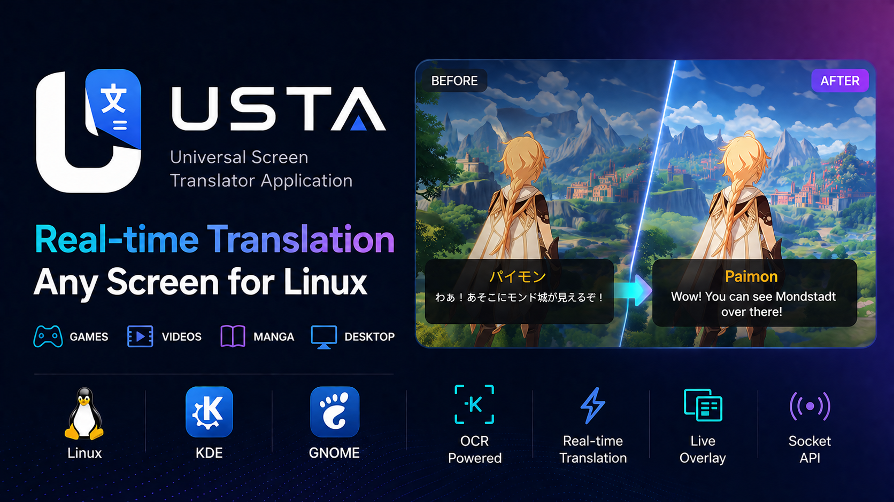

# USTA (Universal Screen Translator Application)
Real-time OCR translation for games, videos and desktop.

[](https://www.youtube.com/watch?v=jGHMmDznum8)

By "sniping" a specific area of your screen, USTA continuously monitors that region, extracts text using OCR (Optical Character Recognition), and overlays the translated text instantly, making it perfect for playing untranslated games or watching foreign media.

> **Note:** Current version is optimized for **KDE Plasma and GNOME (Wayland)** using **xcb** mode. Future versions will expand compatibility.

## 🚀 Key Features

*   **Real-Time HUD Translation:** Specifically designed to provide live translations over video players and game windows.
*   **KDE & Wayland Support:** Currently runs in `xcb` mode, specifically tailored for KDE Plasma environments using native tools for region selection and capture.
*   **Sniper Mode Overlay:** Modular region selection system to target subtitle areas.
*   **Modular OCR Engine Subsystem:** Dynamic multi-backend support (Tesseract & EasyOCR) for accurate text extraction.
*   **Dual-Engine Translation Subsystem:** Context-aware translations via Google Translate and DeepL.
*   **Unix Socket IPC Broadcasting:** Real-time JSON broadcast of every translation to a local Unix socket, enabling integration with other tools (e.g., custom subtitles, logging, or OBS).
*   **Global Shortcuts & IPC Integration:** Utilizes a lightweight single-instance architecture to handle background processes and external CLI-driven shortcuts.

## 📡 External Integration (IPC)

USTA features a built-in Unix Domain Socket server that broadcasts every translation in real-time. This allows you to "pipe" translations into other applications, scripts, or overlays effortlessly.

This feature is designed for high extensibility, making it easy to integrate USTA into your existing workflow:
*   **Live Streaming:** Send translations directly to OBS or other broadcast software as a text source.
*   **Accessibility:** Integrate with text-to-speech (TTS) engines for real-time audio translation.
*   **Data Logging:** Pipe the stream to a file to create a searchable history or transcripts of your sessions.
*   **Custom Overlays:** Build your own UI or specialized subtitles that react to USTA data.

**Socket Path:** `/tmp/usta.sock`

### How to use:
You can listen to the stream using standard tools like `netcat` (nc):
```bash
nc -U /tmp/usta.sock
```

### JSON Output Format:
Every translation is sent as a single line in JSON format:
```json
{
  "original": "Hello world",
  "translated": "Merhaba dünya",
  "source": "en",
  "target": "tr",
  "engine": "Google",
  "timestamp": 1717181234.56
}
```

## 🗺️ Roadmap & Future Support

While currently focused on KDE/Linux, support for the following is planned:
- [ ] **Native Linux Packaging:** Distribution via `.deb` (Debian/Ubuntu), AUR (Arch Linux), and **Flatpak**.
- [ ] **Other Linux DEs:** Full native Wayland support without xcb.
- [ ] **Windows Support:** Integration with Windows-native capture and OCR APIs.
- [ ] **macOS Support:** Support for macOS native APIs and capture systems.

---

## 🛠️ System Requirements

Before running the application, install the system packages required for OCR, PipeWire/GStreamer portal capture, and PyGObject integration.

### CachyOS / Arch packages

```bash
sudo pacman -S --needed --noconfirm git \
  python-virtualenv \
  gst-plugins-base \
  python-gobject \
  python-cairo \
  xcb-util-cursor \
  libxkbcommon-x11 \
  libxcb \
  xcb-util-keysyms \
  xcb-util-wm \
  base-devel \
  tesseract \
  tesseract-data
```

### Fedora packages

```bash
sudo dnf install -y git \
  python3-virtualenv \
  gstreamer1-plugins-base \
  python3-gobject \
  xcb-util-cursor \
  libxkbcommon-x11 \
  libxcb \
  xcb-util-keysyms \
  xcb-util-wm \
  gcc gcc-c++ make \
  python3-devel \
  tesseract \
  tesseract-langpack-rus \
  tesseract-langpack-ara \
  tesseract-langpack-heb \
  tesseract-langpack-tur \
  tesseract-langpack-vie \
  tesseract-langpack-tha \
  tesseract-langpack-spa \
  tesseract-langpack-jpn \
  tesseract-langpack-chs \
  tesseract-langpack-cht
```

### Ubuntu / Debian packages

```bash
sudo apt install -y git \
  python3.14-venv \
  gir1.2-gst-plugins-base-1.0 \
  python3-gi-cairo \
  libxcb-cursor0 \
  libxkbcommon-x11-0 \
  libxcb-render0 \
  libxcb-shape0 \
  libxcb-keysyms1 \
  libxcb-xinerama0 \
  libxcb-xinput0 \
  libxcb-icccm4 \
  build-essential \
  python3-dev \
  tesseract-ocr \
  tesseract-ocr-rus \
  tesseract-ocr-ara \
  tesseract-ocr-heb \
  tesseract-ocr-tur \
  tesseract-ocr-vie \
  tesseract-ocr-tha \
  tesseract-ocr-spa \
  tesseract-ocr-jpn \
  tesseract-ocr-chi-sim \
  tesseract-ocr-chi-tra
```

> **AppImage note:** Ubuntu GNOME requires the FUSE 2 compatibility package for
> AppImage files. Install `libfuse2` to fix `dlopen(): error loading libfuse.so.2`.
> On some newer Ubuntu/Debian releases this package may be named `libfuse2t64`.

---

## 📦 AppImage Usage

After downloading or building the AppImage, make it executable and run it (replace `{version}` with the current USTA version in the downloaded filename):

```bash
chmod +x USTA-{version}-x86_64.AppImage
./USTA-{version}-x86_64.AppImage
```

On Ubuntu/Debian, AppImage files require FUSE 2 support. If running the AppImage
prints `dlopen(): error loading libfuse.so.2`, install the compatibility package:

```bash
sudo apt update
sudo apt install -y libfuse2
```

If your distribution only provides the renamed package, install `libfuse2t64`
instead.

---

## 📦 Installation & Usage

1. **Clone the repository:**
   ```bash
   git clone https://github.com/sedataym/usta.git
   ```

2. **Enter the project directory:**
   ```bash
   cd usta
   ```

3. **Create and activate a virtual environment:**

   PyGObject is normally installed as a system package, not as a regular pip-only dependency. Create the virtual environment with system site packages enabled:

   ```bash
   python -m venv --system-site-packages .venv
   ```

   If the virtual environment already exists, enable system site packages in `.venv/pyvenv.cfg`:

   ```ini
   include-system-site-packages = true
   ```

4. **Install dependencies:**
   ```bash
   .venv/bin/pip install -r requirements.txt
   ```

5. **Run the application:**
   ```bash
   .venv/bin/python run.py
   ```

---

## 🛠️ Tech Stack
* **GUI:** PySide6
* **OCR:** pytesseract, easyocr
* **Translation:** deep-translator
* **Desktop Environments:** KDE Plasma (optimized) / GNOME

---

## ⚠️ Legal Disclaimer and User Responsibility

USTA is provided as-is, without any express or implied warranties, guarantees, or assurances of fitness for a particular purpose. By installing, running, modifying, or distributing this application, you acknowledge that you do so entirely at your own risk.

The user is solely responsible for any and all consequences, damages, losses, liabilities, or legal issues that may arise from the use or misuse of USTA. This includes, but is not limited to, damage to the computer or operating system on which the application is run, loss or corruption of data, performance degradation, privacy or security incidents, unintended screen capture, incorrect OCR output, inaccurate translations, interruption of other applications, or conflicts with system components, drivers, desktop environments, capture portals, OCR engines, translation services, and third-party dependencies.

USTA may process visible screen content, interact with local desktop capture mechanisms, use OCR engines, communicate with translation providers, and expose translation data through local IPC features. Users are responsible for ensuring that their use of the application complies with all applicable laws, regulations, software licenses, platform terms of service, privacy obligations, copyright rules, workplace policies, game or media service terms, and any restrictions related to capturing, processing, translating, storing, broadcasting, or sharing on-screen content.

The developers, maintainers, contributors, and distributors of USTA shall not be held liable for any direct, indirect, incidental, consequential, special, exemplary, or punitive damages resulting from the application, including damages caused by user configuration, third-party services, external integrations, dependency behavior, system incompatibilities, or any other circumstance connected to the use of the software.

If you do not accept full responsibility for the risks described above, you should not install, run, or use USTA.
